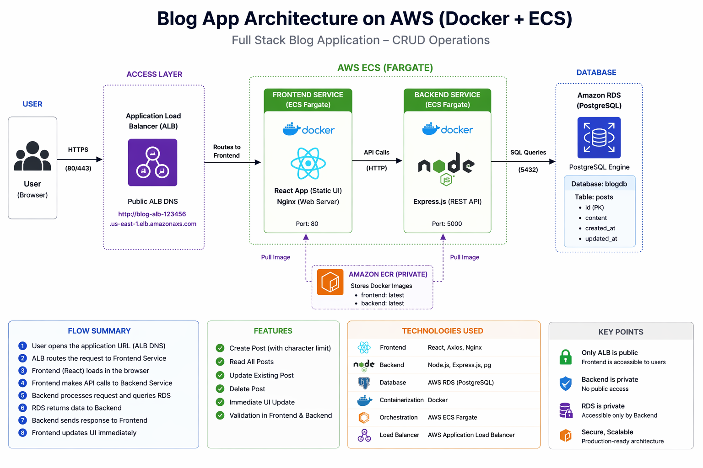
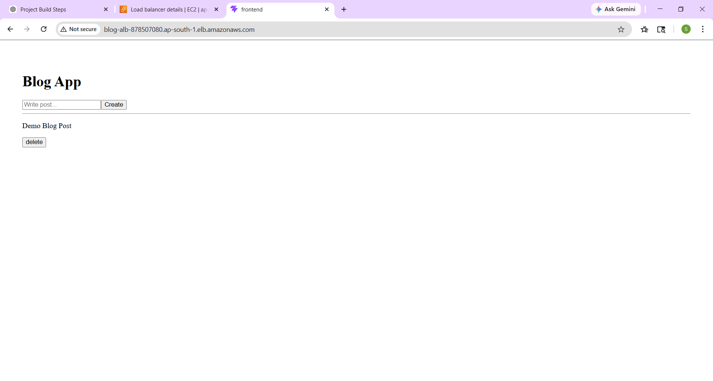
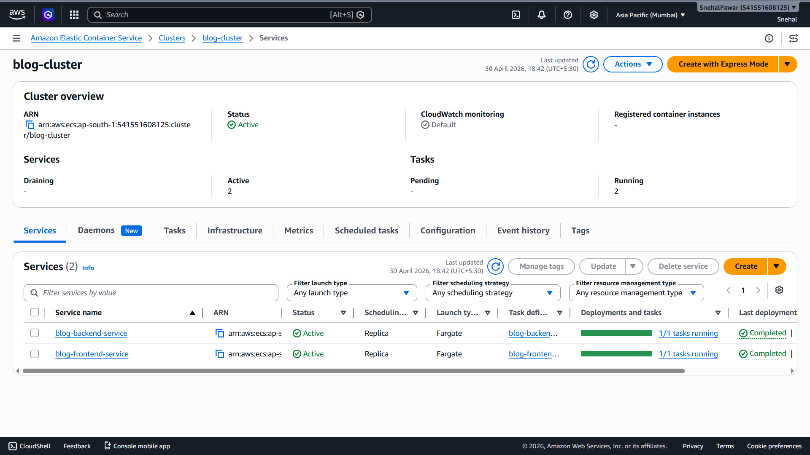
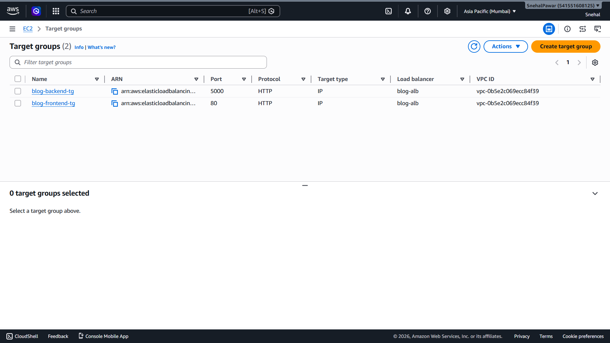
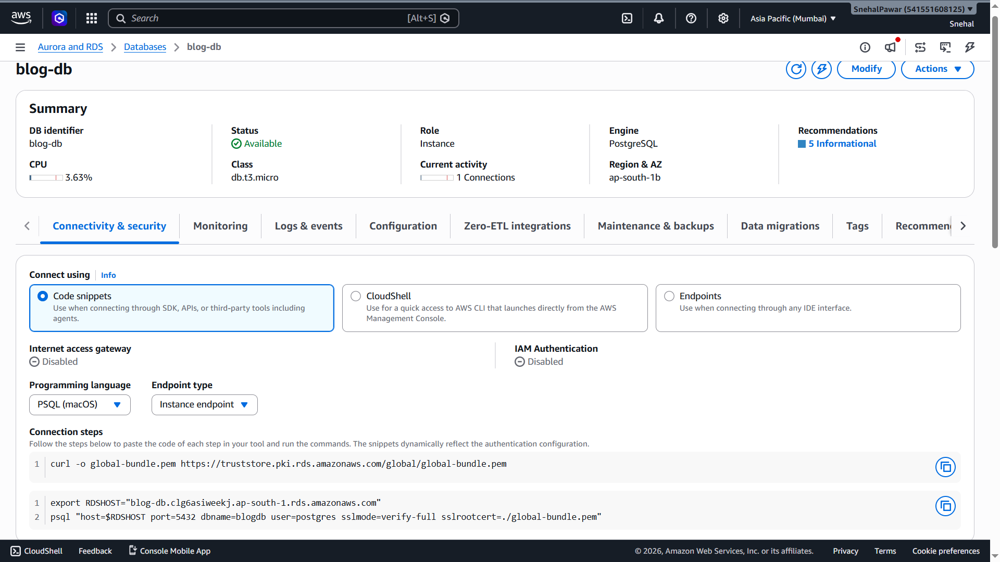
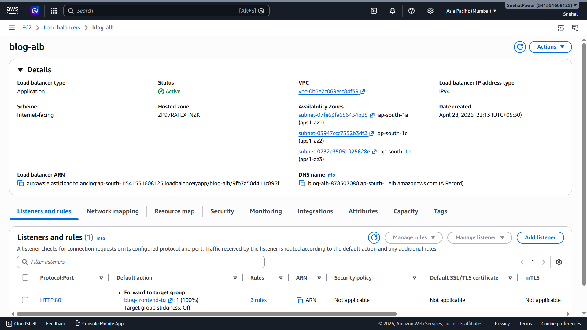

# 🚀 Blog Application on AWS ECS Fargate

---

## 📌 Objective

Deploy a **full-stack blog application** using a **scalable, production-grade AWS architecture** with:

- ECS Fargate (serverless containers)
- Application Load Balancer
- Amazon RDS (PostgreSQL)
- Dockerized frontend & backend

---

## ❗ Problem Statement

Traditional deployments face:

- ❌ No scalability  
- ❌ Manual deployments  
- ❌ No load balancing  
- ❌ Weak database security  
- ❌ Hard to expose publicly  

---

## ✅ Solution Approach

We implemented a **cloud-native microservices architecture**:

### 🧭 Architecture Flow

User → ALB → Frontend (Nginx) → Backend (Node.js) → RDS (PostgreSQL)

## 🏗️ Architecture Diagram

---

## 📁 Project Structure

blog-ecs-app/
│
├── backend/
├── frontend/
├── images/
│   ├── Architecture-Diagram.png
│   ├── ui.png
│   ├── ecs.png
│   ├── target-group.png
│   ├── rds.png
│   └── alb.png
└── README.md

## ⚙️ Complete Deployment Commands (Step-by-Step)

> Region used: ap-south-1  
> Replace ACCOUNT_ID and ALB DNS where needed

---

### 🔹 Step 1 — Create ECR Repositories

aws ecr create-repository --repository-name blog-backend --region ap-south-1  
aws ecr create-repository --repository-name blog-frontend --region ap-south-1  

---

### 🔹 Step 2 — Authenticate Docker to ECR

aws ecr get-login-password --region ap-south-1 | docker login --username AWS --password-stdin ACCOUNT_ID.dkr.ecr.ap-south-1.amazonaws.com

---

### 🔹 Step 3 — Build & Push Docker Images

docker build -t blog-backend ./backend  
docker tag blog-backend:latest ACCOUNT_ID.dkr.ecr.ap-south-1.amazonaws.com/blog-backend:latest  
docker push ACCOUNT_ID.dkr.ecr.ap-south-1.amazonaws.com/blog-backend:latest  

docker build -t blog-frontend ./frontend  
docker tag blog-frontend:latest ACCOUNT_ID.dkr.ecr.ap-south-1.amazonaws.com/blog-frontend:latest  
docker push ACCOUNT_ID.dkr.ecr.ap-south-1.amazonaws.com/blog-frontend:latest  

---

### 🔹 Step 4 — Create IAM Role for ECS

aws iam create-role --role-name ecsTaskExecutionRoleBlog --assume-role-policy-document file://ecs-trust.json  

aws iam attach-role-policy --role-name ecsTaskExecutionRoleBlog --policy-arn arn:aws:iam::aws:policy/service-role/AmazonECSTaskExecutionRolePolicy  

---

### 🔹 Step 5 — Register Task Definitions

aws ecs register-task-definition --cli-input-json file://backend-task.json --region ap-south-1  

aws ecs register-task-definition --cli-input-json file://frontend-task.json --region ap-south-1  

---

### 🔹 Step 6 — Get VPC & Subnets

aws ec2 describe-vpcs --query "Vpcs[0].VpcId" --output text --region ap-south-1  

aws ec2 describe-subnets --filters Name=vpc-id,Values=YOUR_VPC_ID --query "Subnets[*].SubnetId" --output text --region ap-south-1  

---

### 🔹 Step 7 — Create Security Groups

# ALB Security Group (Public)
aws ec2 create-security-group --group-name blog-alb-sg --description "ALB Security Group" --vpc-id YOUR_VPC_ID --region ap-south-1  

aws ec2 authorize-security-group-ingress --group-id ALB_SG_ID --protocol tcp --port 80 --cidr 0.0.0.0/0 --region ap-south-1  

---

# ECS Security Group
aws ec2 create-security-group --group-name blog-ecs-sg --description "ECS Security Group" --vpc-id YOUR_VPC_ID --region ap-south-1  

aws ec2 authorize-security-group-ingress --group-id ECS_SG_ID --protocol tcp --port 80 --source-group ALB_SG_ID --region ap-south-1  

aws ec2 authorize-security-group-ingress --group-id ECS_SG_ID --protocol tcp --port 5000 --source-group ALB_SG_ID --region ap-south-1  

---

# RDS Security Group
aws ec2 authorize-security-group-ingress --group-id RDS_SG_ID --protocol tcp --port 5432 --source-group ECS_SG_ID --region ap-south-1  

---

### 🔹 Step 8 — Create Target Groups

# Frontend
aws elbv2 create-target-group --name blog-frontend-tg --protocol HTTP --port 80 --target-type ip --vpc-id YOUR_VPC_ID --region ap-south-1  

# Backend
aws elbv2 create-target-group --name blog-backend-tg --protocol HTTP --port 5000 --target-type ip --vpc-id YOUR_VPC_ID --health-check-path /api/posts --region ap-south-1  

---

### 🔹 Step 9 — Create Load Balancer

aws elbv2 create-load-balancer --name blog-alb --subnets SUBNET1 SUBNET2 SUBNET3 --security-groups ALB_SG_ID --scheme internet-facing --type application --region ap-south-1  

---

### 🔹 Step 10 — Create Listener

aws elbv2 create-listener --load-balancer-arn ALB_ARN --protocol HTTP --port 80 --default-actions Type=forward,TargetGroupArn=FRONTEND_TG_ARN --region ap-south-1  

---

### 🔹 Step 11 — Create ECS Cluster

aws ecs create-cluster --cluster-name blog-cluster --region ap-south-1  

---

### 🔹 Step 12 — Create Backend Service

aws ecs create-service --cluster blog-cluster --service-name blog-backend-service --task-definition blog-backend --desired-count 1 --launch-type FARGATE --network-configuration "awsvpcConfiguration={subnets=[SUBNET1,SUBNET2,SUBNET3],securityGroups=[ECS_SG_ID],assignPublicIp=ENABLED}" --load-balancers "targetGroupArn=BACKEND_TG_ARN,containerName=backend,containerPort=5000" --region ap-south-1  

---

### 🔹 Step 13 — Create Frontend Service

aws ecs create-service --cluster blog-cluster --service-name blog-frontend-service --task-definition blog-frontend --desired-count 1 --launch-type FARGATE --network-configuration "awsvpcConfiguration={subnets=[SUBNET1,SUBNET2,SUBNET3],securityGroups=[ECS_SG_ID],assignPublicIp=ENABLED}" --load-balancers "targetGroupArn=FRONTEND_TG_ARN,containerName=frontend,containerPort=80" --region ap-south-1  

---

### 🔹 Step 14 — Create Database Table

Connect to RDS:

psql -h YOUR_RDS_ENDPOINT -U postgres -d blogdb  

Run:

CREATE TABLE posts (
  id SERIAL PRIMARY KEY,
  title TEXT,
  content TEXT
);

---

### 🔹 Step 15 — Access Application

http://YOUR-ALB-DNS

## 📸 Screenshots

### 🌐 Application UI

---

### ⚙️ ECS Services Running

---

### 🎯 Target Group Healthy

---

### 🗄️ RDS Database

---

### 🌍 ALB Working

---

## ⚠️ Challenges & Fixes

### 🔴 500 Internal Server Error

* Cause: DB connection issue
* Fix: Correct RDS endpoint + security groups

---

### 🔴 503 / 504 Errors

* Cause: ALB routing failure
* Fix: Proper target group + listener setup

---

### 🔴 pg_hba.conf Error

* Cause: RDS blocked ECS access
* Fix: Allowed ECS SG in RDS SG

---

### 🔴 Container Exit Code 1

* Cause: frontend crash
* Fix: corrected Dockerfile + nginx config

---

### 🔴 e.map is not a function

* Cause: API not returning array
* Fix: ensured JSON array response

---

## 🎯 Final Output

✅ Full CRUD blog app
✅ Publicly accessible via ALB
✅ Scalable ECS architecture
✅ Secure DB connection

---

## 💡 Key Learnings

* ECS Fargate deployment
* Load balancing with ALB
* Debugging production issues
* AWS networking & security
* Container orchestration

---

## 👨‍💻 Author

**Snehal Pawar**
